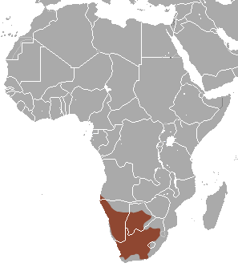

You need to travel to South Africa, Namibia, or Botswana in order to find a meerkat in the wild. Meerkats are active throughout the day, though most active just after sunrise and just before sunset. The best places to search for meerkats are in the the Makgadikgadi Pans of Botswana, and South Africa’s Kalahari region.

{fig-align="center" width="266"}

::: {style="text-align: center;"}
Meerkats (*Suricata suricatta*) Range in Africa
:::
